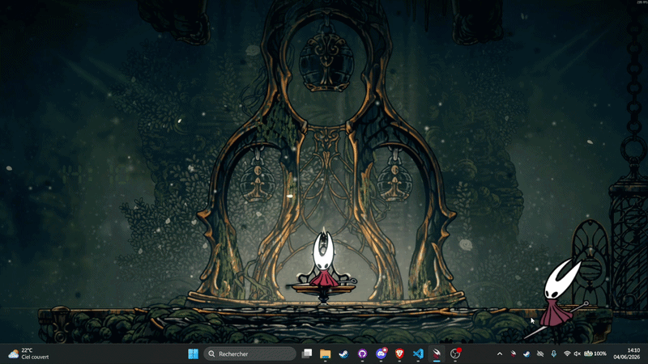

# Hornet Desktop Companion

<div align="center">

[](https://www.gnu.org/licenses/gpl-3.0)
[](https://www.python.org/)
[](#platform-notes)
[](https://github.com/CamoLover/Hornet-Desktop-Companion/stargazers)
[](https://github.com/CamoLover/Hornet-Desktop-Companion/commits/main)
[](https://github.com/CamoLover/Hornet-Desktop-Companion/issues)


*A physics-based desktop companion featuring Hornet from* Hollow Knight. *She sits, sleeps, falls with gravity, bounces or soft-lands, plays the Needoline soundtrack when sitting, reacts to velocity with different sprites, and gets annoyed if you hover near her too long.*



</div>

---

## Features

- **Physics simulation** -  gravity, bounce damping, and friction
- **Animated idle** -  6-frame idle animation cycle
- **Full sitting sequence** -  sit-down → pause → intro → looping play → outro → pause → get-up, with smooth position transitions
- **Sleep** -  after 5 minutes of inactivity on the ground, Hornet falls asleep; a small "z" floats above her head while she sleeps; click her to wake up
- **Soft landing** -  optional mode where Hornet doesn't bounce; plays a landing animation on the floor, and wall-slide / wall-cling animations against screen edges
- **Taunt** -  hover the cursor near Hornet long enough and she'll get annoyed and taunt you; has a cooldown
- **Music** -  plays randomised segments of *Needoline* during the sitting loop; stops when she stands
- **Velocity-reactive sprites** -  fast-fall and tumble sprites trigger based on speed and direction
- **Tray icon** -  control volume, pick a song, and hot-reload config without restarting
- **Click-through** -  window is invisible to mouse clicks when not hovering (Windows)
- **Pixel-perfect transparency** -  no black box; uses the SHAPE extension on Linux or layered windows on Windows
- **Throwable** -  drag and release with momentum to fling her
- **Cloak recoloring** -  choose from color presets or a custom hex color for Hornet's cloak, from the tray icon
- **Spawn animation** -  choose whether Hornet falls in from the top or walks in from the left/right edge of the screen on launch

---

## Quick Start

**Requirements:** Python 3.8+

**Linux / macOS**

```bash
chmod +x run.sh
./run.sh
```

**Windows**

```bat
run.bat
```

The script creates a `.venv`, installs dependencies, and launches the companion. All sprites are bundled -  no extraction step needed.

### Dependencies

| Package | Version |
|---|---|
| `pygame` | >= 2.5.0 |
| `Pillow` | >= 10.0.0 |
| `numpy` | >= 1.24.0 |
| `pystray` | >= 0.19.0 |

---

## Controls

| Action | Input |
|---|---|
| Drag Hornet | Left-click and drag |
| Throw her | Drag, then release with momentum |
| Sit / play music | Drop her on the floor and click when stationary |
| Stop sitting | Click her while in the looping sit animation |
| Wake up | Click her while she is sleeping |
| Quit | `ESC` |

> Dragging is disabled during sleep and sleep transitions. Clicks during the falling-asleep or waking animations are ignored.

---

## Sitting Animation Sequence

| Phase | Sprites | Notes |
|---|---|---|
| Sit down | `sit_down/sit_1–4.png` | Plays once |
| Pause | -  | `sit_pause_dur` seconds |
| Intro | `sit_intro/sit_play_1–4.png` | Plays once; music starts at end |
| Loop | `sit_loop/hornet_sit_play_1–11.png` | Loops until clicked |
| Outro | `sit_outro/sit_end_1–4.png` | Plays once; music stops at start |
| Pause | -  | `sit_pause_dur` seconds |
| Get up | `sit_up/sit_get_up_1–7.png` | Plays once; y-offset eases back to idle; returns to idle |

Dragging Hornet during any sit phase cancels the sequence immediately.

---

## Sleep

If Hornet is left idle on the ground for `sleep_timeout` seconds (default 5 minutes), she falls asleep automatically.

| Phase | Sprites | Notes |
|---|---|---|
| Falling asleep | `sleep_wake/sleep_wake_*.png` (reversed) | Plays once |
| Sleeping | `sleep_wake/sleep_wake_1.png` | Held until clicked; a floating "z" is drawn above her head |
| Waking | `sleep_wake/sleep_wake_*.png` (forward) | Plays once; returns to idle |

Click her while she is sleeping to wake her up. The inactivity timer resets any time she is dragged, thrown, or clicked.

The "z" overlay can be disabled by setting `sleep_z` to `false` in `config.json`.

---

## Soft Landing

When `soft_land` is enabled in `config.json`, Hornet does not bounce on impact. Instead:

| Situation | Sprites | Notes |
|---|---|---|
| Hitting the floor | `land/land_1–10.png` | Landing animation plays once, then transitions to idle |
| Sliding down a wall | `wall_slide/wall_slide_1–9.png` | Plays while descending along a screen edge |
| Reaching the wall bottom | `wall_cling/wall_cling_1–4.png` | Cling animation plays once before transitioning to idle |

---

## Taunt

If the cursor hovers near Hornet for `taunt_hover_time` seconds (default 2.5 s) while she is idle or on the ground, she gets annoyed and plays her taunt animation.

| Phase | Sprites |
|---|---|
| Taunt | `taunt/taunt_1–19.png` |
| Silk effect | `taunt/taunt_silk_1–8.png` |

After taunting, she enters a cooldown (`taunt_cooldown`, default 120 s) before she can be triggered again.

---

## Tray Icon

Right-click (Windows) or click (Linux) the tray icon to access:

| Entry | Effect |
|---|---|
| **Songs → Random** | Pick a random Needoline segment each time she sits |
| **Songs → [name]** | Lock to a specific segment |
| **Volume → 0–100%** | Set playback volume |
| **Cloak Color → [preset]** | Recolor Hornet's cloak; takes effect immediately |
| **Cloak Color → Custom…** | Pick any color via a color picker dialog |
| **Spawn Mode → Fall (Default)** | Hornet drops in from the top on launch |
| **Spawn Mode → Walk from Right / Left** | Hornet walks in from the chosen screen edge on launch |
| **Reload Config** | Hot-reload `config.json` -  applies all values instantly, including scale |
| **Reset Topmost** | Force the window back to the top of the z-order (Windows only) |
| **Quit** | Close the companion |

Available songs: Default Melody, Beastling Call, Elegy of the Deep, Conductor Melody, Vaultkeeper Melody, Architect Melody, Trial End.

Available cloak presets: Default, Red, Orange, Yellow, Green, Teal, Blue, Purple, Pink -  or any custom hex color.

> Spawn mode is saved to `config.json` and applies the next time the companion is launched.

---

## Configuration (`config.json`)

All values hot-reload instantly via **Tray → Reload Config**.

| Key | Default | Effect |
|---|---|---|
| `gravity` | `1800.0` | Downward acceleration (px/s²) |
| `bounce_damp` | `0.45` | Velocity fraction retained after bouncing |
| `friction` | `0.88` | Horizontal slowdown per bounce |
| `min_bounce_vy` | `80.0` | Minimum vertical speed to keep bouncing |
| `fast_fall_vy` | `300.0` | Vertical speed threshold for fast-fall sprite |
| `wrong_mix` | `0.65` | Horizontal speed ratio that triggers the tumble sprite |
| `idle_fps` | `0.15` | Seconds per frame for the idle animation |
| `sit_fps` | `0.1` | Seconds per frame for all sit animations |
| `sit_pause_dur` | `0.25` | Pause duration (seconds) between sit-down→intro and outro→get-up |
| `sit_y_offset` | `0.235` | Downward position offset while sitting (fraction of sprite height) |
| `idle_y_offset` | `-0.075` | Vertical position offset while idle (fraction of sprite height) |
| `on_ground_tol` | `8` | Pixel tolerance for "on ground" detection |
| `sleep_timeout` | `300.0` | Seconds of ground inactivity before falling asleep |
| `sleep_y_offset` | `0.12` | Vertical position offset during sleep transition frames (fraction of sprite height) |
| `volume` | `1.0` | Music volume (0.0 – 1.0) |
| `scale` | `100` | Sprite scale percentage (50 = half size, 200 = double) |
| `sleep_z` | `true` | Show a floating "z" above Hornet's head while she sleeps |
| `soft_land` | `true` | Enable soft landing / wall-slide instead of bouncing |
| `land_fps` | `0.04` | Seconds per frame for landing and wall-cling animations |
| `wall_slide_fps` | `0.08` | Seconds per frame for the wall-slide animation |
| `taunt_fps` | `0.06` | Seconds per frame for the taunt animation |
| `taunt_cooldown` | `120.0` | Seconds before Hornet can be taunted again |
| `taunt_hover_time` | `2.5` | Seconds the cursor must hover near Hornet to trigger a taunt |
| `cloak_color` | `"default"` | Cloak hue -  `"default"` or a `"#RRGGBB"` hex string |
| `spawn_mode` | `"fall"` | How Hornet enters on launch -  `"fall"`, `"walk_from_right"`, or `"walk_from_left"` |

---

## File Overview

| File / Folder | Purpose |
|---|---|
| `companion.py` | Main app -  physics, animation, rendering, platform integration |
| `run.sh` / `run.bat` | One-shot launcher scripts |
| `requirements.txt` | Python dependencies |
| `config.json` | Tunable physics, animation and display parameters |
| `assets/sprites/idle/` | 6-frame idle animation |
| `assets/sprites/fast_fall/` | Fast-fall and tumble sprites |
| `assets/sprites/sit_down/` | Sit-down transition (4 frames) |
| `assets/sprites/sit_intro/` | Intro to playing (4 frames) |
| `assets/sprites/sit_loop/` | Looping sit animation (11 frames) |
| `assets/sprites/sit_outro/` | Outro from playing (4 frames) |
| `assets/sprites/sit_up/` | Get-up transition (7 frames) |
| `assets/sprites/land/` | Soft landing animation (10 frames) |
| `assets/sprites/wall_slide/` | Wall-slide animation (9 frames) |
| `assets/sprites/wall_cling/` | Wall-cling animation (4 frames) |
| `assets/sprites/taunt/` | Taunt animation (19 frames + 8-frame silk effect) |
| `assets/sprites/sleep_wake/` | Sleep / wake transition (14 frames, played forward and reversed) |
| `assets/sprites/walk/` | Walk-in entrance animation (10 frames) |
| `assets/sprites/walk_stop/` | Walk-in stop transition (5 frames) |
| `assets/audio/needoline.mp3` | Background music track |
| `assets/logo/` | App icon (PNG + ICO) |

---

## Platform Notes

### Windows
- Full transparency and always-on-top via the Win32 layered window API.
- Click-through is toggled automatically when not hovering over Hornet.
- `run.bat` uses `pythonw` to suppress the console window.

### Linux
- Requires a compositor (picom, kwin, mutter) for background transparency. Without one, the SHAPE extension is used for pixel-perfect clipping.
- Always-on-top is set via EWMH `_NET_WM_STATE_ABOVE`. If it doesn't stick: `wmctrl -r "Hornet" -b add,above`
- On Wayland: `SDL_VIDEODRIVER=x11 python companion.py`

### macOS
- pygame transparency is unreliable on macOS -  the window may show a black background.
- Functional but not fully tested; Windows and Linux are better supported.

---

## Contributing

Issues and pull requests are welcome. If you find a bug or have a feature request, please [open an issue](https://github.com/CamoLover/Hornet-Desktop-Companion/issues).

---

## Legal

This project is a fan tool and is not affiliated with or endorsed by Team Cherry.

Hollow Knight and all associated assets, characters, and music are property of **Team Cherry**.

This project itself is released under the [GNU General Public License v3.0](LICENSE) -  you are free to use, modify, and distribute it under the same terms.
